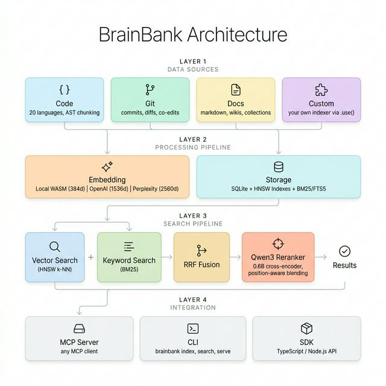

# 🧠 BrainBank

**Persistent, searchable memory for AI agents.** Index your codebase, git history, documents, and any custom data into a single SQLite file — then search it all with hybrid vector + keyword retrieval.

BrainBank gives LLMs a long-term memory that persists between sessions.

- **All-in-one** — core + code + git + docs + CLI in a single `brainbank` package
- **Pluggable indexers** — `.use()` only what you need (code, git, docs, or custom)
- **Dynamic collections** — `brain.collection('errors')` for any structured data
- **Hybrid search** — vector + BM25 fused with Reciprocal Rank Fusion
- **Pluggable embeddings** — local WASM (free) or OpenAI (higher quality)
- **Multi-repo** — index multiple repositories into one shared database
- **Portable** — single `.brainbank/brainbank.db` file
- **Optional packages** — [`@brainbank/memory`](#memory) (deterministic fact extraction), [`@brainbank/reranker`](#reranker) (Qwen3 cross-encoder), [`@brainbank/mcp`](#mcp-server) (MCP server)



---

## Why BrainBank?

Built for a multi-repo codebase that needed unified AI context. Zero infrastructure, zero ongoing cost.

Most AI memory solutions (mem0, Zep, LangMem) require cloud services, external databases, or LLM calls just to store a memory. BrainBank takes a different approach:

| | **BrainBank** | **mem0** | **Zep** | **LangMem** |
|---|:---:|:---:|:---:|:---:|
| Infrastructure | **SQLite file** | Vector DB + cloud | Neo4j + cloud | LangGraph Platform |
| LLM required to write | **No**¹ | Yes | Yes | Yes |
| Code-aware | **19 AST-parsed languages (tree-sitter), git, co-edits** | ✗ | ✗ | ✗ |
| Custom indexers | **`.use()` plugin system** | ✗ | ✗ | ✗ |
| Search | **Vector + BM25 + RRF** | Vector + graph² | Vector + BM25 + graph | Vector only |
| Framework lock-in | **None** | Optional | Zep cloud | LangChain |
| Portable | **Copy one file** | Tied to DB | Tied to cloud | Tied to platform |

> ¹ mem0 and Zep use LLMs to auto-extract memories from raw text. BrainBank is explicit — you decide what gets stored. Less magic, more control.
>
> ² mem0's graph store (mem0g) is available in the paid platform version.

**In short:**
- **Code-first** — the only memory layer that understands code structure, git history, and file co-edit relationships
- **$0 memory bill** — no LLM calls to extract/consolidate. You store what you want, BrainBank embeds deterministically
- **Truly portable** — `.brainbank/brainbank.db` is a normal file. Copy it, back it up, `git lfs` it
- **No vendor lock-in** — plain TypeScript, works with any agent framework or none at all

### Table of Contents

- [Why BrainBank?](#why-brainbank)
- [Installation](#installation)
- [Quick Start](#quick-start)
- [CLI](#cli)
- [Programmatic API](#programmatic-api)
  - [Indexers](#indexers)
  - [Collections](#collections)
  - [Search](#search)
  - [Document Collections](#document-collections)
  - [Context Generation](#context-generation)
  - [Custom Indexers](#custom-indexers)
  - [AI Agent Integration](#ai-agent-integration)
  - [Examples](#examples)
  - [Watch Mode](#watch-mode)
- [MCP Server](#mcp-server)
- [Configuration](#configuration)
  - [Embedding Providers](#embedding-providers)
  - [Reranker](#reranker)
- [Memory](#memory)
- [Multi-Repository Indexing](#multi-repository-indexing)
- [Indexing](#indexing-1)
  - [Incremental Indexing](#incremental-indexing)
  - [Re-embedding](#re-embedding)
- [Architecture](#architecture)
  - [Search Pipeline](#search-pipeline)
- [Benchmarks](#benchmarks)
  - [Search Quality: AST vs Sliding Window](#search-quality-ast-vs-sliding-window)
  - [Grammar Support](#grammar-support)

---

## Installation

```bash
npm install brainbank
```

### Optional Packages

| Package | When to install |
|---------|----------------|
| `@brainbank/memory` | Deterministic memory extraction for LLM conversations (mem0-style pipeline) |
| `@brainbank/reranker` | Cross-encoder reranker (Qwen3-0.6B, ~640MB model) |
| `@brainbank/mcp` | MCP server for AI tool integration |

```bash
# Memory — automatic fact extraction & dedup for chatbots/agents
npm install @brainbank/memory

# Reranker — improves search ranking with local neural inference
npm install @brainbank/reranker node-llama-cpp

# MCP server — for Antigravity, Claude Desktop, etc.
npm install @brainbank/mcp
```

---

## Quick Start

Get semantic search over your codebase in under a minute:

```typescript
import { BrainBank } from 'brainbank';
import { code } from 'brainbank/code';
import { git } from 'brainbank/git';

const brain = new BrainBank({ repoPath: '.' })
  .use(code())
  .use(git());

await brain.index();  // indexes code + git history (incremental)

// Search across everything
const results = await brain.hybridSearch('authentication middleware');
console.log(results.map(r => `${r.filePath}:${r.line} (${r.score.toFixed(2)})`));

// Store agent memory
const log = brain.collection('decisions');
await log.add(
  'Switched from bcrypt to argon2id for password hashing. ' +
  'Argon2id is memory-hard and recommended by OWASP for new projects. ' +
  'Updated src/auth/hash.ts and all tests.',
  { tags: ['security', 'auth'] }
);

// Recall later: "what did we decide about password hashing?"
const hits = await log.search('password hashing decision');

await brain.close();
```

Or use the CLI — zero code:

```bash
npm install -g brainbank
brainbank index .                          # index code + git
brainbank hsearch "rate limiting"           # hybrid search
brainbank kv add decisions "Use Redis..."   # store a memory
brainbank kv search decisions "caching"     # recall it
```

## CLI

BrainBank can be used entirely from the command line — no config file needed.

### Indexing

`index` processes **code files + git history** by default. Use `--only` to select specific modules, and `--docs` to include document collections.

```bash
brainbank index [path]                      # Index code + git history
brainbank index [path] --force              # Force re-index everything
brainbank index [path] --depth 200          # Limit git commit depth
brainbank index [path] --only code          # Index only code (skip git)
brainbank index [path] --only git           # Index only git history
brainbank index [path] --docs ~/docs        # Include a docs folder
brainbank docs [--collection <name>]        # Index document collections
```

> **Multi-repo:** If `[path]` contains multiple Git subdirectories (no root `.git/`), BrainBank auto-detects them and indexes all into one shared DB. See [Multi-Repository Indexing](#multi-repository-indexing).

### Watch Mode

Auto-re-index code files when they change. Watches for file changes and re-indexes incrementally:

```bash
brainbank watch                             # Watch repo, auto re-index on save
# ━━━ BrainBank Watch ━━━
#   Watching /path/to/repo for changes...
#   14:30:02 ✓ code: src/api.ts
#   14:30:05 ✓ code: src/routes.ts
#   14:30:08 ✓ csv: data/metrics.csv       ← custom indexer
```

> Watch mode monitors **code files** by default. [Custom indexers](#custom-indexers) that implement `watchPatterns()` and `onFileChange()` are automatically picked up — their name appears in the console output alongside the built-in `code` indexer. Git history and document collections are not affected by file-system changes and must be re-indexed explicitly with `brainbank index` / `brainbank docs`.

### Document Collections

```bash
brainbank collection add <path> --name docs # Register a document folder
brainbank collection list                   # List registered collections
brainbank collection remove <name>          # Remove a collection
```

### Search

```bash
brainbank search <query>                    # Semantic search (vector)
brainbank hsearch <query>                   # Hybrid search (best quality)
brainbank ksearch <query>                   # Keyword search (BM25, instant)
brainbank dsearch <query>                   # Document search
```

### Context

```bash
brainbank context <task>                    # Get formatted context for a task
brainbank context add <col> <path> <desc>   # Add context metadata
brainbank context list                      # List context metadata
```

### KV Store (dynamic collections)

```bash
brainbank kv add <coll> <content>           # Add item to a collection
brainbank kv search <coll> <query>          # Search a collection
brainbank kv list [coll]                    # List collections or items
brainbank kv trim <coll> --keep <n>         # Keep only N most recent
brainbank kv clear <coll>                   # Clear all items
```

### Utility

```bash
brainbank stats                             # Show index statistics
brainbank reembed                           # Re-embed all vectors (provider switch)
brainbank watch                             # Watch files, auto re-index on change
brainbank serve                             # Start MCP server (stdio)
```

**Global options:** `--repo <path>`, `--force`, `--depth <n>`, `--collection <name>`, `--pattern <glob>`, `--context <desc>`, `--reranker <name>`

---

## Programmatic API

Use BrainBank as a library in your TypeScript/Node.js project.

### Indexers

BrainBank uses pluggable indexers. Register only what you need with `.use()`:

| Indexer | Import | Description |
|---------|--------|-------------|
| `code` | `brainbank/code` | AST-aware code chunking via tree-sitter (19 languages) |
| `git` | `brainbank/git` | Git commit history, diffs, co-edit relationships |
| `docs` | `brainbank/docs` | Document collections (markdown, wikis) |

```typescript
import { BrainBank } from 'brainbank';
import { code } from 'brainbank/code';
import { git } from 'brainbank/git';
import { docs } from 'brainbank/docs';

// Pick only the indexers you need
const brain = new BrainBank({ repoPath: '.' })
  .use(code())
  .use(git())
  .use(docs());

// Index code + git (incremental — only processes changes)
await brain.index();

// Index document collections
await brain.addCollection({ name: 'wiki', path: '~/docs', pattern: '**/*.md' });
await brain.indexDocs();
```

### Collections

Dynamic key-value collections with semantic search — the building block for agent memory:

```typescript
const decisions = brain.collection('decisions');

// Store rich content (auto-embedded for vector search)
await decisions.add(
  'Use SQLite with WAL mode instead of PostgreSQL. Portable single-file ' +
  'storage, works offline, zero infrastructure.',
  { tags: ['architecture'], metadata: { files: ['src/db.ts'] } }
);

// Semantic search — finds by meaning, not keywords
const hits = await decisions.search('why not postgres');
// → [{ content: 'Use SQLite with WAL...', score: 0.95, tags: [...], metadata: {...} }]

// Management
decisions.list({ limit: 20 });          // newest first
decisions.list({ tags: ['architecture'] }); // filter by tags
decisions.count();                      // total items
decisions.trim({ keep: 50 });           // keep N most recent
decisions.prune({ olderThan: '30d' });  // remove older than 30 days
brain.listCollectionNames();            // → ['decisions', ...]
```

> 📂 See [examples/collections](examples/collections/) for a complete runnable demo with cross-collection linking and metadata.

### Watch Mode

Auto-re-index when files change:

```typescript
// API
const watcher = brain.watch({
  debounceMs: 2000,
  onIndex: (file, indexer) => console.log(`${indexer}: ${file}`),
  onError: (err) => console.error(err.message),
});

// Later: watcher.close();
```

```bash
# CLI
brainbank watch
# ━━━ BrainBank Watch ━━━
# Watching /path/to/repo for changes...
# 14:30:02 ✓ code: src/api.ts
# 14:30:05 ✓ code: src/routes.ts
```

#### Custom Indexer Watch

Custom indexers can hook into watch mode by implementing `onFileChange` and `watchPatterns`:

```typescript
import type { Indexer, IndexerContext } from 'brainbank';

function csvIndexer(): Indexer {
  let ctx: IndexerContext;

  return {
    name: 'csv',

    async initialize(context) {
      ctx = context;
    },

    // Tell watch which files this indexer cares about
    watchPatterns() {
      return ['**/*.csv', '**/*.tsv'];
    },

    // Called when a watched file changes
    async onFileChange(filePath, event) {
      if (event === 'delete') return true;

      const data = fs.readFileSync(filePath, 'utf-8');
      const col = ctx.collection('csv_data');
      await col.add(data, {
        tags: ['csv'],
        metadata: { file: filePath },
      });
      return true; // handled
    },
  };
}

const brain = new BrainBank({ dbPath: './brain.db' })
  .use(code())
  .use(csvIndexer());

await brain.initialize();
brain.watch(); // Now watches .ts, .py, etc. AND .csv, .tsv
```

### Search

Three modes, from fastest to best quality:

| Mode | Method | Speed | Quality |
|------|--------|-------|---------|
| Keyword | `searchBM25(q)` | ⚡ instant | Good for exact terms |
| Vector | `search(q)` | ~50ms | Good for concepts |
| **Hybrid** | `hybridSearch(q)` | ~100ms | **Best — catches both** |

```typescript
// Hybrid search (recommended default)
const results = await brain.hybridSearch('authentication middleware');

// Scoped search
const codeHits = await brain.searchCode('parse JSON config', 8);
const commitHits = await brain.searchCommits('fix auth bug', 5);
const docHits = await brain.searchDocs('getting started', { collection: 'wiki' });
```

| Score | Meaning |
|-------|---------|
| 0.8+ | Near-exact match |
| 0.5–0.8 | Strongly related |
| 0.3–0.5 | Somewhat related |
| < 0.3 | Weak match |

### Document Collections

Register folders of documents. Files are chunked by heading structure:

```typescript
await brain.addCollection({
  name: 'docs',
  path: '~/project/docs',
  pattern: '**/*.md',
  ignore: ['**/drafts/**'],
  context: 'Project documentation',
});

await brain.indexDocs();

// Add context metadata (helps LLM understand what documents are about)
brain.addContext('docs', '/api', 'REST API reference');
brain.addContext('docs', '/guides', 'Step-by-step tutorials');
```

### Context Generation

Get formatted markdown ready for system prompt injection:

```typescript
const context = await brain.getContext('add rate limiting to the API', {
  codeResults: 6,
  gitResults: 5,
  affectedFiles: ['src/api/routes.ts'],
  useMMR: true,
});
// Returns: ## Relevant Code, ## Git History, ## Relevant Documents
```

### Custom Indexers

Implement the `Indexer` interface to build your own:

```typescript
import type { Indexer, IndexerContext } from 'brainbank';

const myIndexer: Indexer = {
  name: 'custom',
  async initialize(ctx: IndexerContext) {
    // ctx.db            — shared SQLite database
    // ctx.embedding     — shared embedding provider
    // ctx.collection()  — create dynamic collections
    const store = ctx.collection('my_data');
    await store.add('indexed content', { source: 'custom' });
  },
};

brain.use(myIndexer);
```

#### Using custom indexers with the CLI

Drop `.ts` files into `.brainbank/indexers/` — the CLI auto-discovers them:

```
.brainbank/
├── brainbank.db
└── indexers/
    ├── slack.ts
    └── jira.ts
```

Each file exports a default `Indexer`:

```typescript
// .brainbank/indexers/slack.ts
import type { Indexer } from 'brainbank';

export default {
  name: 'slack',
  async initialize(ctx) {
    const msgs = ctx.collection('slack_messages');
    // ... fetch and index slack messages
  },
} satisfies Indexer;
```

That's it — all CLI commands automatically pick up your indexers:

```bash
brainbank index                             # runs code + git + docs + slack + jira
brainbank stats                             # shows all indexers
brainbank kv search slack_messages "deploy"  # search slack data
```

#### Advanced: config file

For fine-grained control, create a `.brainbank/config.ts`:

```typescript
// .brainbank/config.ts
export default {
  builtins: ['code', 'docs'],   // exclude git (default: all three)
  brainbank: {                   // BrainBank constructor options
    dbPath: '.brainbank/brain.db',
  },
};
```

Everything lives in `.brainbank/` — DB, config, and custom indexers:

```
.brainbank/
├── brainbank.db        # SQLite database (auto-created)
├── config.ts           # Optional project config
└── indexers/           # Optional custom indexer files
    ├── slack.ts
    └── jira.ts
```

No folder and no config file? The CLI uses the built-in indexers (`code`, `git`, `docs`).

---

### AI Agent Integration

Teach your AI coding agent to use BrainBank as persistent memory. Add an `AGENTS.md` (or `.cursor/rules`) to your project root — works with **Antigravity**, **Claude Code**, **Cursor**, and anything that reads project-level instructions.

<details>
<summary><strong>Option A: CLI commands</strong> (zero setup)</summary>

> **Memory — BrainBank**
>
> **Store** a conversation summary after each task:
> `brainbank kv add conversations "Refactored auth to AuthService with DI. JWT + refresh tokens + RBAC."`
>
> **Record** architecture decisions:
> `brainbank kv add decisions "ADR: Fastify over Express. 2x throughput, schema validation, native TS."`
>
> **Search** before starting work:
> `brainbank hsearch "auth middleware"` · `brainbank kv search decisions "auth"`

</details>

<details>
<summary><strong>Option B: MCP tools</strong> (richer integration)</summary>

> **Memory — BrainBank (MCP)**
>
> Use the BrainBank MCP tools for persistent agent memory:
>
> **Store** via `brainbank_kv_add`:
> `{ collection: "conversations", content: "Refactored auth to AuthService with DI.", tags: ["auth"] }`
>
> **Search** via `brainbank_kv_search`:
> `{ collection: "decisions", query: "authentication approach" }`
>
> **Code search** via `brainbank_hybrid_search`:
> `{ query: "auth middleware", repo: "." }`

</details>

#### Setup

| Agent | How to connect |
|-------|---------------|
| **Antigravity** | Add `AGENTS.md` to project root |
| **Claude Code** | Add `AGENTS.md` to project root |
| **Cursor** | Add rules in `.cursor/rules` |
| **MCP** (any agent) | See [MCP Server](#mcp-server) config below |

#### Custom Indexer: Auto-Ingest Conversation Logs

For agents that produce structured logs (e.g. Antigravity's `brain/` directory), auto-index them:

```typescript
// .brainbank/indexers/conversations.ts
import type { Indexer, IndexerContext } from 'brainbank';
import * as fs from 'node:fs';
import * as path from 'node:path';

export default {
  name: 'conversations',
  async initialize(ctx: IndexerContext) {
    const conversations = ctx.collection('conversations');
    const logsDir = path.join(ctx.repoPath, '.gemini/antigravity/brain');
    if (!fs.existsSync(logsDir)) return;

    for (const dir of fs.readdirSync(logsDir)) {
      const file = path.join(logsDir, dir, '.system_generated/logs/overview.txt');
      if (!fs.existsSync(file)) continue;
      const content = fs.readFileSync(file, 'utf-8');
      if (content.length < 100) continue;
      await conversations.add(content, {
        tags: ['auto'],
        metadata: { session: dir, source: 'antigravity' },
      });
    }
  },
} satisfies Indexer;
```

```bash
brainbank index   # now auto-indexes conversation logs alongside code + git
brainbank kv search conversations "what did we decide about auth"
```

### Examples

| Example | Description | Run |
|---------|-------------|-----|
| [chatbot](examples/chatbot/) | CLI chatbot with streaming + persistent memory (context injection + function calling) | `OPENAI_API_KEY=sk-... npx tsx examples/chatbot/chatbot.ts` |
| [collections](examples/collections/) | Collections, semantic search, tags, metadata linking | `npx tsx examples/collections/collections.ts` |

---

## MCP Server

BrainBank ships with an MCP server (stdio) for AI tool integration.

```bash
brainbank serve
```

### Antigravity / Claude Desktop

Add to your MCP config (`~/.gemini/antigravity/mcp_config.json` or Claude Desktop settings):

```json
{
  "mcpServers": {
    "brainbank": {
      "command": "npx",
      "args": ["-y", "@brainbank/mcp"],
      "env": {
        "BRAINBANK_EMBEDDING": "openai"
      }
    }
  }
}
```

The agent passes the `repo` parameter on each tool call based on the active workspace — no hardcoded paths needed.

> Set `BRAINBANK_EMBEDDING` to `openai` for higher quality search (requires `OPENAI_API_KEY`). Omit to use the free local WASM embeddings.

> Optionally set `BRAINBANK_REPO` as a default fallback repo. If omitted, every tool call must include the `repo` parameter (recommended for multi-workspace setups).

### Available Tools

| Tool | Description |
|------|-------------|
| `brainbank_hybrid_search` | Best quality: vector + BM25 + reranker |
| `brainbank_search` | Semantic vector search |
| `brainbank_keyword_search` | Instant BM25 full-text |
| `brainbank_context` | Formatted context for a task |
| `brainbank_index` | Trigger code/git indexing |
| `brainbank_stats` | Index statistics |
| `brainbank_history` | Git history for a file |
| `brainbank_coedits` | Files that change together |
| `brainbank_collection_add` | Add item to a KV collection |
| `brainbank_collection_search` | Search a KV collection |
| `brainbank_collection_trim` | Trim a KV collection |

---

## Configuration

```typescript
import { BrainBank, OpenAIEmbedding } from 'brainbank';
import { Qwen3Reranker } from '@brainbank/reranker';  // separate package

const brain = new BrainBank({
  repoPath: '.',
  dbPath: '.brainbank/brainbank.db',
  gitDepth: 500,
  maxFileSize: 512_000,
  embeddingDims: 1536,
  maxElements: 2_000_000,
  embeddingProvider: new OpenAIEmbedding(),   // or: omit for free local WASM (384d)
  reranker: new Qwen3Reranker(),              // local cross-encoder (auto-downloads ~640MB)
});
```

### Embedding Providers

| Provider | Import | Dims | Speed | Cost |
|----------|--------|------|-------|------|
| **Local (default)** | built-in | 384 | ⚡ 0ms | Free |
| **OpenAI** | `OpenAIEmbedding` | 1536 | ~100ms | $0.02/1M tokens |

```typescript
import { OpenAIEmbedding } from 'brainbank';

// Uses OPENAI_API_KEY env var by default
new OpenAIEmbedding();

// Custom options
new OpenAIEmbedding({
  model: 'text-embedding-3-large',
  dims: 512,                          // custom dims (text-embedding-3 only)
  apiKey: 'sk-...',
  baseUrl: 'https://my-proxy.com/v1/embeddings',  // Azure, proxies
});
```

> ⚠️ Switching embedding provider requires re-indexing — vectors are not cross-compatible.

### Reranker

BrainBank includes an optional cross-encoder reranker using **Qwen3-Reranker-0.6B** via `node-llama-cpp`. It runs 100% locally — no API keys needed. The reranker is **disabled by default**.

#### When to Use It

The reranker runs local neural inference on every search result, which improves ranking precision but adds significant latency. Here are real benchmarks on a ~2100 file / 4000+ chunk codebase:

| Metric | Without Reranker | With Reranker |
|--------|-----------------|---------------|
| **Warm query time** | ~480ms | ~5500ms |
| **Cold start** | ~7s | ~12s |
| **Memory overhead** | — | +640MB (model) |
| **Ranking quality** | Good (RRF) | Slightly better |

**Recommended:** Leave it disabled for interactive use (MCP, IDE integrations). The RRF fusion of vector + BM25 already produces high-quality results. Enable it only for:

- Batch processing where latency doesn't matter
- Very large codebases (50k+ files) where false positives are costly
- Server environments with RAM to spare

#### Enabling the Reranker

```typescript
import { BrainBank } from 'brainbank';
import { Qwen3Reranker } from '@brainbank/reranker';

const brain = new BrainBank({
  reranker: new Qwen3Reranker(),  // ~640MB model, auto-downloaded on first use
});
```

Or from the CLI:

```bash
brainbank hsearch "auth middleware" --reranker qwen3
```

Or via environment variable:

```bash
BRAINBANK_RERANKER=qwen3 brainbank serve
```

The model is cached at `~/.cache/brainbank/models/` after first download.

#### Position-Aware Score Blending

When enabled, the reranker uses position-aware blending — trusting retrieval scores more for top results and the reranker more for lower-ranked results:

| Position | Retrieval (RRF) | Reranker | Rationale |
|----------|----------------|----------|----------|
| 1–3 | **75%** | 25% | Preserves exact keyword matches |
| 4–10 | **60%** | 40% | Balanced blend |
| 11+ | 40% | **60%** | Trust reranker for uncertain results |

#### Custom Reranker

Implement the `Reranker` interface to use your own:

```typescript
import type { Reranker } from 'brainbank';

const myReranker: Reranker = {
  async rank(query: string, documents: string[]): Promise<number[]> {
    // Return relevance scores 0.0-1.0 for each document
  },
  async close() { /* optional cleanup */ },
};
```

Without a reranker, BrainBank uses pure RRF fusion — which is already production-quality for most use cases.

---

## Memory

`@brainbank/memory` adds **deterministic memory extraction** to any LLM conversation. After every turn, it automatically extracts facts, deduplicates against existing memories, and decides `ADD` / `UPDATE` / `NONE` — no function calling needed.

Inspired by [mem0](https://github.com/mem0ai/mem0)'s pipeline, but framework-agnostic and built on BrainBank collections.

```bash
npm install @brainbank/memory
```

```typescript
import { BrainBank } from 'brainbank';
import { Memory, OpenAIProvider } from '@brainbank/memory';

const brain = new BrainBank({ dbPath: './memory.db' });
await brain.initialize();

const memory = new Memory(brain.collection('memories'), {
  llm: new OpenAIProvider({ model: 'gpt-4.1-nano' }),
});

// After every conversation turn (deterministic, automatic)
await memory.process(userMessage, assistantResponse);
// → extracts facts, deduplicates, executes ADD/UPDATE/NONE

// For the system prompt
const context = memory.buildContext();
// → "## Memories\n- User's name is Berna\n- Prefers TypeScript"
```

The `LLMProvider` interface works with any framework:

| Framework | Adapter |
|-----------|--------|
| OpenAI | Built-in `OpenAIProvider` |
| LangChain | `ChatOpenAI.invoke()` → string |
| Vercel AI SDK | `generateText()` → string |
| Any LLM | Implement `{ generate(messages) → string }` |

> 📂 See [examples/chatbot](examples/chatbot/) for runnable demos with all three frameworks.

> 📦 Full docs: [packages/memory/README.md](packages/memory/README.md)

---

### Environment Variables

| Variable | Description |
|----------|-------------|
| `BRAINBANK_REPO` | Default repository path (optional — auto-detected from `.git/` or passed per tool call) |
| `BRAINBANK_EMBEDDING` | Embedding provider: `local` (default), `openai` |
| `BRAINBANK_RERANKER` | Reranker: `none` (default), `qwen3` to enable |
| `BRAINBANK_DEBUG` | Show full stack traces |
| `OPENAI_API_KEY` | Required when using `BRAINBANK_EMBEDDING=openai` |

---

## Multi-Repository Indexing

BrainBank can index multiple repositories into a **single shared database**. This is useful for monorepos, microservices, or any project split across multiple Git repositories.

### How It Works

When you point BrainBank at a directory that contains multiple Git repositories (subdirectories with `.git/`), the CLI **auto-detects** them and creates namespaced indexers:

```bash
~/projects/
├── webapp-frontend/   # .git/
├── webapp-backend/    # .git/
└── webapp-shared/     # .git/
```

```bash
brainbank index ~/projects --depth 200
```

```
━━━ BrainBank Index ━━━
  Repo: /Users/you/projects
  Multi-repo: found 3 git repos: webapp-frontend, webapp-backend, webapp-shared
  CODE:WEBAPP-BACKEND [0/1075] ...
  CODE:WEBAPP-FRONTEND [0/719] ...
  GIT:WEBAPP-SHARED [0/200] ...

  Code: 2107 indexed, 4084 chunks
  Git:  600 indexed (200 per repo)
  Co-edit pairs: 1636
```

All code, git history, and co-edit relationships from every sub-repository go into **one** `.brainbank/brainbank.db` at the parent directory. Search queries automatically return results across all repositories:

```bash
brainbank hsearch "cancel job confirmation" --repo ~/projects
# → Results from frontend components, backend controllers,
#   and shared utilities — all in one search.
```

### Namespaced Indexers

Each sub-repository gets its own namespaced indexer instances (e.g., `code:frontend`, `git:backend`). Same-type indexers share a single HNSW vector index for efficient memory usage and unified search.

### Programmatic API

```typescript
import { BrainBank } from 'brainbank';
import { code } from 'brainbank/code';
import { git } from 'brainbank/git';

const brain = new BrainBank({ repoPath: '~/projects' })
  .use(code({ name: 'code:frontend', repoPath: '~/projects/webapp-frontend' }))
  .use(code({ name: 'code:backend', repoPath: '~/projects/webapp-backend' }))
  .use(git({ name: 'git:frontend', repoPath: '~/projects/webapp-frontend' }))
  .use(git({ name: 'git:backend', repoPath: '~/projects/webapp-backend' }));

await brain.initialize();
await brain.index();

// Cross-repo search
const results = await brain.hybridSearch('authentication guard');
// → Results from both frontend and backend
```

### MCP Multi-Workspace

The MCP server maintains a pool of BrainBank instances — one per unique `repo` path. Each tool call can target a different workspace:

```typescript
// Agent working in one workspace
brainbank_hybrid_search({ query: "login form", repo: "/Users/you/projects" })

// Agent switches to a different project
brainbank_hybrid_search({ query: "API routes", repo: "/Users/you/other-project" })
```

Instances are cached in memory after first initialization, so subsequent queries to the same repo are fast (~480ms).

---

## Indexing

### Code Chunking (tree-sitter)

BrainBank uses **native tree-sitter** to parse source code into ASTs and extract semantic blocks — functions, classes, methods, interfaces — as individual chunks. This produces dramatically better embeddings than naive line-based splitting.

**Supported languages (AST-parsed):**

| Category | Languages |
|----------|-----------|
| Web | TypeScript, JavaScript, HTML, CSS |
| Systems | Go, Rust, C, C++, Swift |
| JVM | Java, Kotlin, Scala |
| Scripting | Python, Ruby, PHP, Lua, Bash, Elixir |
| .NET | C# |

For large classes (>80 lines), the chunker descends into the class body and extracts each method as a separate chunk. For unsupported languages, it falls back to a sliding window with overlap.

> Tree-sitter grammars are **optional dependencies**. If a grammar isn't installed, that language falls back to the generic sliding window. Install only the grammars you need: `npm install tree-sitter-ruby tree-sitter-go` etc.

### Incremental Indexing

All indexing is **incremental by default** — only new or changed content is processed:

| Indexer | How it detects changes | What gets skipped |
|---------|----------------------|-------------------|
| **Code** | FNV-1a hash of file content | Unchanged files |
| **Git** | Unique commit hash | Already-indexed commits |
| **Docs** | SHA-256 of file content | Unchanged documents |

```typescript
// First run: indexes everything
await brain.index();  // → { indexed: 500, skipped: 0 }

// Second run: skips everything unchanged
await brain.index();  // → { indexed: 0, skipped: 500 }

// Changed 1 file? Only that file re-indexes
await brain.index();  // → { indexed: 1, skipped: 499 }
```

Use `--force` to re-index everything:

```bash
brainbank index --force
```

### Re-embedding

When switching embedding providers (e.g. Local → OpenAI), you **don't need to re-index**. The `reembed()` method regenerates only the vectors — no file I/O, no git parsing, no re-chunking:

```typescript
import { BrainBank, OpenAIEmbedding } from 'brainbank';

// Previously indexed with local embeddings.
// Now switch to OpenAI:
const brain = new BrainBank({
  embeddingProvider: new OpenAIEmbedding(),
});
await brain.initialize();

// ⚠ BrainBank emits 'warning' event if provider changed.
brain.on('warning', (w) => console.warn(w.message));
// → "Embedding provider changed (LocalEmbedding/384 → OpenAIEmbedding/1536). Run brain.reembed()"

const result = await brain.reembed({
  onProgress: (table, current, total) => {
    console.log(`${table}: ${current}/${total}`);
  },
});
// → { code: 1200, git: 500, docs: 80, kv: 45, notes: 12, total: 1837 }
```

Or from the CLI:

```bash
brainbank reembed
```

| Full re-index | `reembed()` |
|---|---|
| Walks all files | **Skipped** |
| Parses git history | **Skipped** |
| Re-chunks documents | **Skipped** |
| Embeds text | ✓ |
| Replaces vectors | ✓ |
| Rebuilds HNSW | ✓ |

> BrainBank tracks provider metadata in `embedding_meta` table. It auto-detects mismatches and warns you to run `reembed()`.

---

## Benchmarks

BrainBank includes benchmark scripts to validate chunking quality and search relevance. Run them against your own codebase to see the impact.

### Search Quality: AST vs Sliding Window

We compared BrainBank's **tree-sitter AST chunker** against the traditional **sliding window** (80-line blocks) on a production NestJS backend (3,753 lines across 8 service files). Both strategies chunk the same files; all chunks are embedded and searched with the same 10 domain-specific queries.

#### How It Works

```
Sliding Window                          Tree-Sitter AST
┌────────────────────┐                  ┌────────────────────┐
│ import { ... }     │                  │ ✓ constructor()    │  → named chunk
│ @Injectable()      │  → L1-80 block   │ ✓ findAll()        │  → named chunk
│ class JobsService {│                  │ ✓ createJob()      │  → named chunk
│   constructor()    │                  │ ✓ cancelJob()      │  → named chunk
│   findAll() { ... }│                  │ ✓ updateStatus()   │  → named chunk
│   createJob()      │                  └────────────────────┘
│   ...              │
│ ────────────────── │  overlaps ↕
│   cancelJob()      │  → L75-155 block
│   updateStatus()   │
│   ...              │
└────────────────────┘
```

**Sliding window** mixes imports, constructors, and multiple methods into one embedding. Search for "cancel a job" and you get a generic block.
**AST chunking** gives each method its own embedding. Search for "cancel a job" → direct hit on `cancelJob()`.

#### Results (Production NestJS Backend — 3,753 lines)

Tested with 10 domain-specific queries on 8 service files (`orders.service.ts`, `bookings.service.ts`, `notifications.service.ts`, etc.):

| Metric | Sliding Window | Tree-Sitter AST |
|--------|:-:|:-:|
| **Query Wins** | 0/10 | **8/10** (2 ties) |
| **Top-1 Relevant** | 3/10 | **8/10** |
| **Avg Precision@3** | 1.1/3 | **1.7/3** |
| **Avg Score Delta** | — | **+0.035** |

#### Per-Query Breakdown

| Query | SW Top Result | AST Top Result | Δ Score |
|-------|:---:|:---:|:---:|
| cancel an order | generic `L451-458` | **`updateOrderStatus`** | +0.005 |
| create a booking | generic `L451-458` | **`createInstantBooking`** | +0.068 |
| confirm booking | generic `L451-458` | **`confirm`** | +0.034 |
| send notification | generic `L226-305` | **`publishNotificationEvent`** | +0.034 |
| authenticate JWT | generic `L1-80` | **`AuthModule`** | +0.032 |
| tenant DB connection | `L76-155` | **`onModuleDestroy`** | +0.037 |
| list orders paginated | `L76-155` | **`findAllActive`** | +0.045 |
| reject booking | generic `L451-458` | **`reject`** | +0.090 |

> Notice how the sliding window returns the **same generic block `L451-458`** for 4 different queries. The AST chunker returns a different, correctly named method each time.

#### Chunk Quality Comparison

| | Sliding Window | Tree-Sitter AST |
|---|:-:|:-:|
| Total chunks | 53 | **83** |
| Avg lines/chunk | 75 | **39** |
| Named chunks | 0 | **83** (100%) |
| Chunk types | `block` | `method`, `interface`, `class` |

### Grammar Support

All 9 core grammars verified, each parsing in **<0.05ms**:

| Language | AST Nodes Extracted | Parse Time |
|----------|:---:|:---:|
| TypeScript | `export_statement`, `interface_declaration` | 0.04ms |
| JavaScript | `function_declaration` × 3 | 0.04ms |
| Python | `class_definition`, `function_definition` × 2 | 0.03ms |
| Go | `function_declaration`, `method_declaration` × 3 | 0.04ms |
| Rust | `struct_item`, `impl_item`, `function_item` | 0.03ms |
| Ruby | `class`, `method` | 0.03ms |
| Java | `class_declaration` | 0.02ms |
| C | `function_definition` × 3 | 0.05ms |
| PHP | `class_declaration` | 0.03ms |

> Additional grammars available: C++, Swift, C#, Kotlin, Scala, Lua, Elixir, Bash, HTML, CSS

### Running Benchmarks

```bash
# Grammar support (9 languages, parse speed)
node test/benchmarks/grammar-support.mjs

# Search quality A/B (uses BrainBank's own source files)
node test/benchmarks/search-quality.mjs
```

---

## Architecture

<details>
<summary>Text version</summary>

```
┌──────────────────────────────────────────────────────┐
│                   BrainBank Core                     │
│  .use(code)  .use(git)  .use(docs)                   │
│  .collection('name')                                 │
├──────────────────────────────────────────────────────┤
│                                                      │
│  ┌─────────┐ ┌─────────┐ ┌─────────┐ ┌────────────┐│
│  │  Code   │ │   Git   │ │  Docs   │ │ Collection ││
│  │ Indexer │ │ Indexer │ │ Indexer │ │ (dynamic)  ││
│  └────┬────┘ └────┬────┘ └────┬────┘ └─────┬──────┘│
│       │           │           │             │        │
│  ┌────▼────┐ ┌────▼────┐ ┌────▼────┐ ┌─────▼──────┐│
│  │  HNSW   │ │  HNSW   │ │  HNSW   │ │ Shared KV  ││
│  │  Index  │ │  Index  │ │  Index  │ │ HNSW Index ││
│  └─────────┘ └─────────┘ └─────────┘ └────────────┘│
│                                                      │
│  ┌──────────────────────────────────────────────────┐│
│  │         SQLite (.brainbank/brainbank.db)         ││
│  │  code_chunks │ git_commits │ doc_chunks          ││
│  │  kv_data │ FTS5 full-text │ vectors │ co_edits   ││
│  └──────────────────────────────────────────────────┘│
│                                                      │
│  ┌──────────────────────────────────────────────────┐│
│  │  Embedding (Local WASM 384d │ OpenAI 1536d)      ││
│  └──────────────────────────────────────────────────┘│
│  ┌──────────────────────────────────────────────────┐│
│  │  Qwen3-Reranker (opt-in cross-encoder)            ││
│  └──────────────────────────────────────────────────┘│
└──────────────────────────────────────────────────────┘
```
</details>

### Search Pipeline

```
Query
  │
  ├──► Vector Search (HNSW k-NN)  ──► candidates
  ├──► Keyword Search (BM25/FTS5)  ──► candidates
  │
  ▼
Reciprocal Rank Fusion (RRF, k=60)
  │
  ▼
Qwen3-Reranker (yes/no + logprobs → score 0-1)
  │
  ▼
Position-Aware Blend
  Top 1-3:  75% RRF / 25% reranker
  Top 4-10: 60% RRF / 40% reranker
  Top 11+:  40% RRF / 60% reranker
  │
  ▼
Final results (sorted by blended score)
```

### Data Flow

1. **Index** — Indexers parse files into chunks (tree-sitter AST for code, heading-based for docs)
2. **Embed** — Each chunk gets a vector (local WASM or OpenAI)
3. **Store** — Chunks + vectors → SQLite, vectors → HNSW index
4. **Search** — Query → HNSW k-NN + BM25 keyword → RRF fusion → optional reranker
5. **Context** — Top results formatted as markdown for system prompts

---

## Testing

```bash
npm test                    # Unit tests (129 tests)
npm test -- --integration   # Full suite (211 tests, includes real models + all domains)
npm test -- --filter code   # Filter by test name
npm test -- --verbose       # Show assertion details
```

---

## License

MIT
